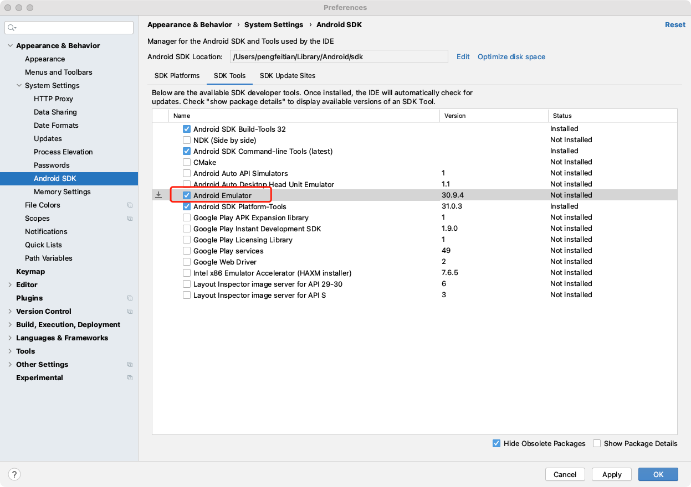

# Tips

## Clean the Gradle caches

```bash
find ~/.gradle -type f -name "*.lock" -delete
```

## Detox e2e setup common issues

1. Out of memory error when run `./gradlew assembleDebug assembleAndroidTest -DtestBuildType=debug`

   ```java
   java.lang.OutOfMemoryError: Java heap space
   ```

   **Solution:**

   Add `org.gradle.jvmargs=-Xmx4608m` to `android/build.gradle`

2. run `detox test --configuration ios.sim.debug` works successfully but failed when run `detox test --configuration android.emu.debu` after setting up detox following detox official documents

   ```bash
   DetoxRuntimeError: Test Failed: '(view has effective visibility <VISIBLE> and view.getGlobalVisibleRect() covers at least <75> percent of the view's area)' doesn't match the selected view.
       Expected: (view has effective visibility <VISIBLE> and view.getGlobalVisibleRect() covers at least <75> percent of the view's area)
           Got: was null
   ```

   **Solution:**

   comment `await device.reloadReactNative();` in `beforeEach()` of `firstTest.e2e.js` gemerated by `detox init`

   ```javascript
   beforeEach(async () => {
     // await device.reloadReactNative();
   });
   ```

3. Cannot resolve symbol 'TestButlerProbe'

   **Solution:**

   Comment `TestButlerProbe.assertReadyIfInstalled();` in the `DetoxTest.java` if you don't use TestButler

   ```java
   // TestButlerProbe.assertReadyIfInstalled();
   ```

4. Run `sdkmanager` throws error

   run `sdkmanager --list` and get `java.lang.NoClassDefFoundError`

   ```java
   xception in thread "main" java.lang.NoClassDefFoundError: javax/xml/bind/annotation/XmlSchema
           at com.android.repository.api.SchemaModule$SchemaModuleVersion.<init>(SchemaModule.java:156)
           at com.android.repository.api.SchemaModule.<init>(SchemaModule.java:75)
           at com.android.sdklib.repository.AndroidSdkHandler.<clinit>(AndroidSdkHandler.java:81)
           at com.android.sdklib.tool.sdkmanager.SdkManagerCli.main(SdkManagerCli.java:73)
           at com.android.sdklib.tool.sdkmanager.SdkManagerCli.main(SdkManagerCli.java:48)
   Caused by: java.lang.ClassNotFoundException: javax.xml.bind.annotation.XmlSchema
           at java.base/jdk.internal.loader.BuiltinClassLoader.loadClass(BuiltinClassLoader.java:641)
           at java.base/jdk.internal.loader.ClassLoaders$AppClassLoader.loadClass(ClassLoaders.java:188)
           at java.base/java.lang.ClassLoader.loadClass(ClassLoader.java:520)
           ... 5 more
   ```

   **Solution:**

   - Install Java 1.8
   - Run the command line with `JAVA_HOME` environment variable

   ```bash
    JAVA_HOME=$(/usr/libexec/java_home -v 1.8) sdkmanager --list
   ```

   or

   ```bash
   JAVA_HOME=$(/usr/libexec/java_home -v 1.8) $ANDROID_HOME/tools/bin/sdkmanager --list
   ```

5. Latest `emulator` cannot launch the avd device

   Run`$ANDROID_HOME/tools/bin/sdkmanager --install emulator` to install the latest android emulator, but cannot launch avd with error `The emulator process for AVD xxx has terminated.`

   **Solution:**

   Just remove the installed emulator by

   ```bash
   $ANDROID_HOME/tools/bin/sdkmanager --uninstall emulator
   ```

   and install the emulator from Android Studio by

   `Preference...` -> `Appearance & Behavior` -> `System Settings` -> `Android SDK` -> `SDK Tools` -> Tick `Android Emulator` -> Click `Apply` and `OK`.

   

