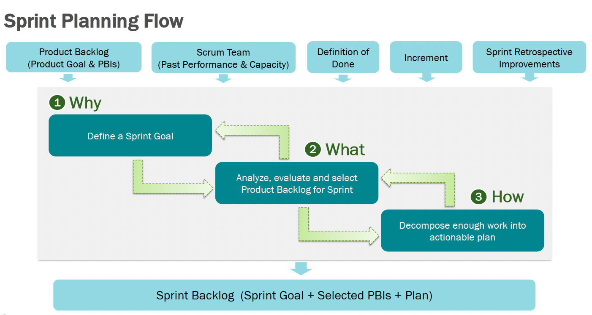
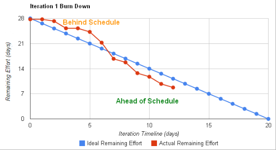
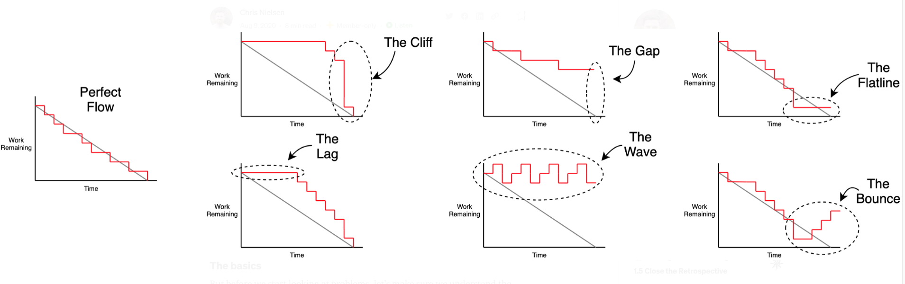
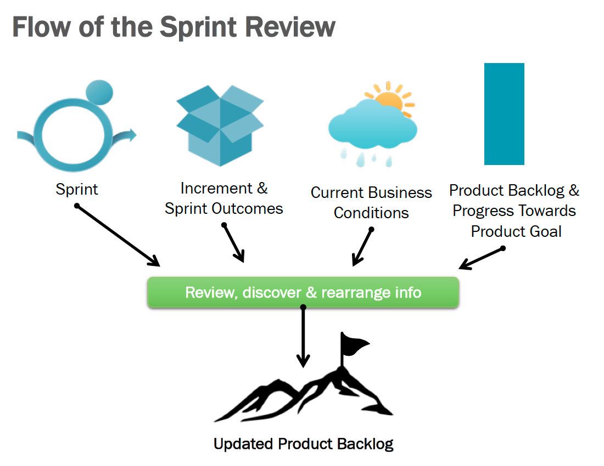
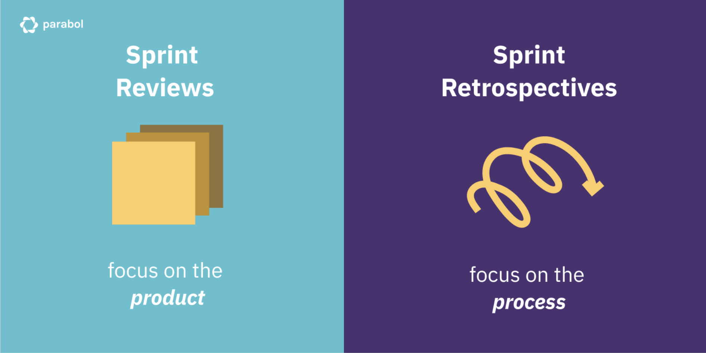
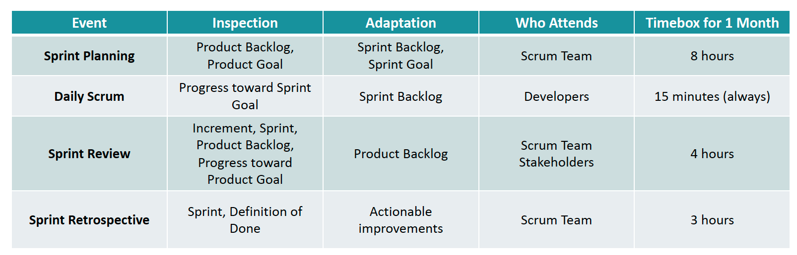

# Scrum Events

### Sprint

Sprint是一个迭代的时间段. 每一个sprint, 都应该服务一个有价值增长的迭代.

1. 所有的工作都是为达到Product Goal来服务的, 包括所有的Scrum Events 
2. 通常一个Sprint是1个月或这更少. 一般两周为最佳实践. 最好是一个连续的时间, 即一个sprint之后紧接着下一个sprint.
3. 如果Sprint Goal不在有效, Product Owner是随时可以被取消Sprint, 以体现敏捷.
4. 在一个sprint期间, 产品质量不应下降
5. Scrum中没有一期二期(Phases)等概念, 只有sprint.
6. 每一个sprint都应该是一个协议(Agreement), Scrum Team内部以及Scrum Team与Stakeholders之间的协议. 体现Transparent.

### Sprint Planning Meeting

**1. Sprint Planning Flow**

**2. Sprint Goal是一个承诺(Commitment)**

* Sprint Goal是Sprint的唯一目标
* Sprint的指引, 重点以,灵活性以及如何实现, 都是以Sprint Goal为基础的
* 在Sprint Goal不被影响的情况下, 随着对Sprint的认知的加深, Sprint的范围是可以被重新定义的 
* 在Product Backlog中的Item被加到Sprint当中之后, Product Backlog中的Items可以继续添加, 改变或者精炼.

**3.Sprint Backlog**

Sprint Backlog的组成

* Sprint Goal
* 从Product Backlog中选取的Items
* 一个可交付的递增(Increment)组成

Sprint Backlog的特点

* 高度可见(Transparent)
* 实时更新且计划好的工作, 这些工作都是为实现Sprint Goal而设计的

Sprint Backlog的操作

* 由Developer来创建和更新

### Sprint Daily Meeting

1. 15分钟的日常活动(Daily Event）Topics: 昨天做了什么, 今天要做什么, 被什么卡住了. 
2. 在固定的时间和地点发生
3. 不是一个解决问题的会议, 即不在会议上讨论问题的解决方案
4. 不是一个检查状态的会议
5. Developers需要检查当前的进度, 是否是朝Sprint Goal的方向推进的
6. Developers创建下一个工作日的计划

监控Sprint进度  -> 燃尽图(Burndown Chart)

Sprint管理不好的燃尽图

### Sprint Review meeting

### Sprint Restropective Meeting

1. Scrum Team应该检视上个Sprint运行的状况, 应该从以下几个方面进行:

    * Developer自身
    * Developer之间的交互
    * Sprint的处理过程
    * Defination of Done

2. Scrum Team通过识别出哪些是最有用的改变, 从而提高Sprint效率

### Review Meeting VS Restropective Meeting

https://www.parabol.co/blog/sprint-reviews-vs-retrospectives/

**Review:** 哪些task没做完, task难点在哪里, 是否影响到了sprint goal, 下个sprint可能会做些什么, etc.

**Restropective:** 是否PO添加了新的需求, Scrum Team是否打破了承诺, 是否遵循了Scrum框架. 哪些流程是可认可的, 哪里是可以改进的. 

### Scrum Events 总结

