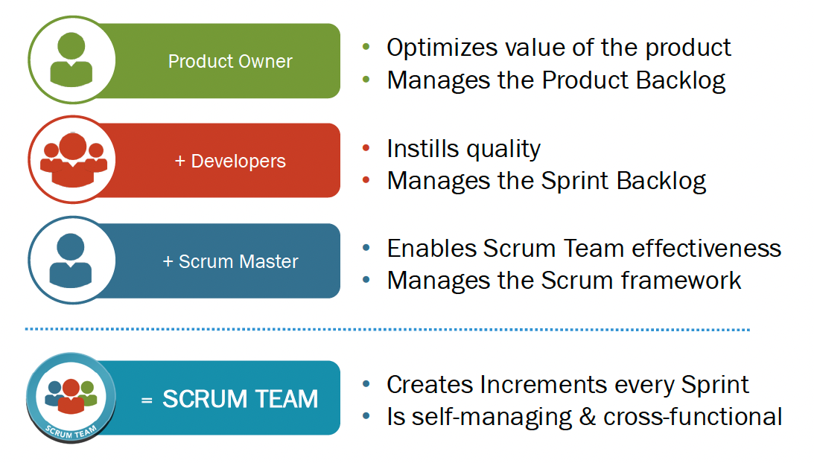

# Scrum Team

Scrum Team可以很高频的创造出有价值的功能, 且需要团队是可以自我管理(self-managing)和跨功能(cross-functional)团队

### Product Owner

1. 优化产品价值
2. 管理产品的Backlog(Product Backlog)
3. 唯一决定需求的人

### Scrum Master(一个服务性的领导角色)

1. 保证团队效率
2. 管理团队, 以确保团队符合Scrum的框架
3. Scrum Master是否成功, 是用团队其它人的成长和成功来衡量的
4. 影响力: 使整个团队对做事和产出更加富有责任心
5. 不使用权利去领导, 团队成员自愿性选择跟随
6. 能让团队成员感觉自己的工作更有价值

### Developer

1. 保证产品质量
2. 管理Sprint Backlog